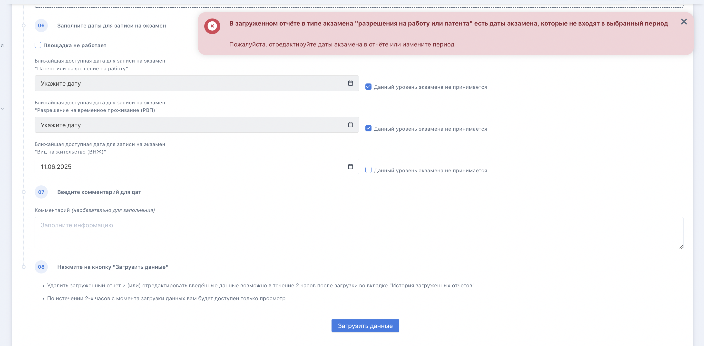

При загрузке файла с данными по тем, кто сдавал экзамен, возможны следующие ошибки:

-  **Невалидная дата рождения**: необходимо зайти в файл и выставить даты рождения в соответствии с форматом DD.MM.YYYY ( ДД.ММ.ГГГГ), сохранить исправленный вариант в формате \*csv и загрузить повторно во Flow.

{width=1520px height=907px}

-  **Отсутствует серия и номер документа, удостоверяющего личность гражданина**: необходимо зайти в файл, найти строку, где не выставлен номер документа, выставить его, сохранить исправленный вариант в формате \*csv и загрузить повторно во Flow.

{width=1520px height=719px}

-  **В загруженном отчёте в типе экзамена "разрешения на работу или патента" есть даты экзамена, которые не входят в выбранный период**: необходимо зайти в файл, найти строку/строки, где даты проведения экзамена не входят в диапазон дат с шага 2, выставить даты экзаменов, входящие в диапазон, указанный на шаге 2, или удалить строки из других диапазонов (для них необходимо будет создать новый файл и загрузить его в соответствующий диапазон шага  2), сохранить исправленный вариант в формате \*csv и загрузить повторно во Flow.

{width=2888px height=1422px}

-  Отсутствует статус экзамена по количеству набранных баллов: необходимо зайти в файл, найти строку, где не выставлен статус в столбце "Статус сдачи", выставить его, сохранить исправленный вариант в формате \*csv и загрузить повторно во Flow.

{width=1520px height=633px}

-  **Отсутствует тип экзамена**: необходимо зайти в файл, найти строку, где не выставлен тип в столбце "Экзамен на уровень, соответствующий цели получения", выставить его (можно выставить (скопировать и затем вставить) только 1 из трёх вариантов:

   -  разрешения на работу или патента,

   -  разрешения на временное проживание,

   -  вида на жительство),

   сохранить исправленный вариант в формате \*csv и загрузить повторно во Flow.

{width=1520px height=595px}